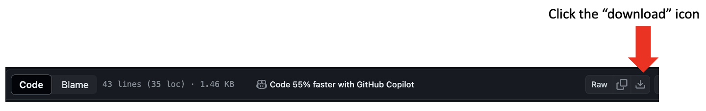

# studio_template

This repository helps a modeler download PhysiCell Studio and an appropriate 
executable model (`project`) for their computer (currently just Windows or Mac).

We assume you have a Python installation. From a command line window (Terminal on Mac; 
Powershell on Windows), run this command:
```
pip install requests
```

Download this Python script into a directory where you want to run the Studio:
[get_studio.py](get_studio.py)




then run:
```
python get_studio.py
```

This should create a `studio` directory. Run the following (only necessary if you are using your computer's default Python and not the Anaconda distribution):
```
cd studio
pip install -r requirements.txt
```

Next, download [project_mac.zip](project_mac.zip) if you're on a Mac or [project_win.zip](project_win.zip) if
you're on Windows. Move the .zip file into the `studio` directory and uncompress it.

You should then be ready to run:
```
python bin/studio.py
```
to display the Studio GUI:


and run a simulation (`project` or `project.exe` executable in the Run tab).


