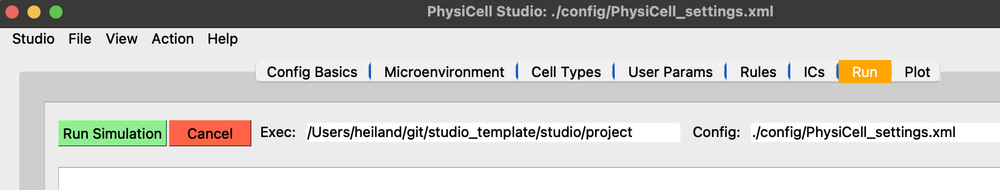
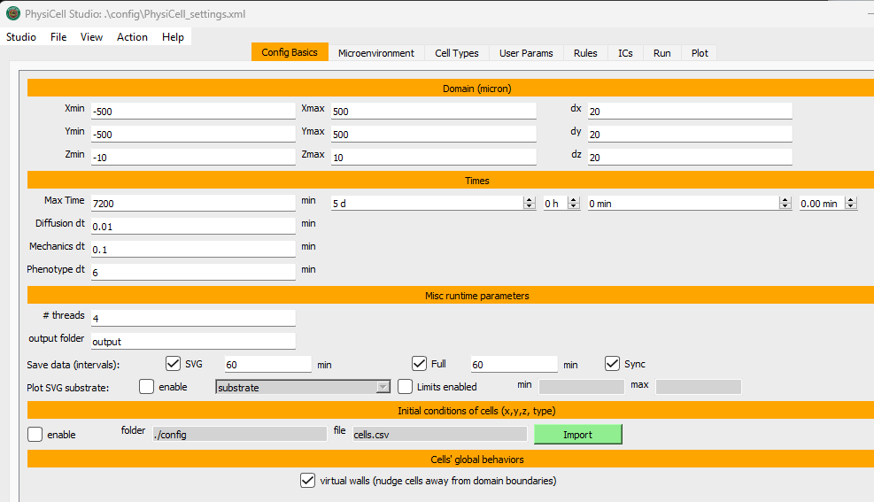
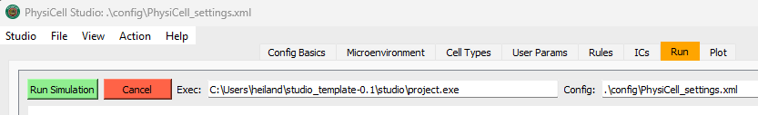

# studio_template

This repository contains a version of PhysiCell Studio with an appropriate 
executable model (`project`) for their computer (currently just Windows or Mac).
We assume you have a Python installation on your computer (you should).

Download the latest release (.zip at https://github.com/rheiland/studio_template/releases) of this repository and uncompress it which will create a `studio` directory.

From a command line terminal, run the following:
```
cd studio_template-0.2   # or whatever the release suffix is
cd studio
pip3 install -r requirements.txt
```

You should then be ready to run:
```
python bin/studio.py
```
to display the Studio GUI:


and run a simulation (`project` or `project.exe` executable in the Run tab).


---
## Installing and running from Windows Powershell

After downloading the latest release (.zip). Assumes you are in your home folder:
```
PS C:\Users\heiland> mv C:\Users\heiland\Downloads\studio_template-0.1.zip .
PS C:\Users\heiland> unzip .\studio_template-0.1.zip
PS C:\Users\heiland> cd .\studio_template-0.1\studio\
PS C:\Users\heiland\studio_template-0.1\studio> pip3 install -r .\requirements.txt
PS C:\Users\heiland\studio_template-0.1\studio> python3 .\bin\studio.py
```




Details of the Windows installation:
```
Windows PowerShell
Copyright (C) Microsoft Corporation. All rights reserved.

Install the latest PowerShell for new features and improvements! https://aka.ms/PSWindows

PS C:\Users\heiland> mv C:\Users\heiland\Downloads\studio_template-0.1.zip .
PS C:\Users\heiland> unzip .\studio_template-0.1.zip
Archive:  .\studio_template-0.1.zip
486a9efc2ee61c3c6e8017e0d18050767b9a9c79
   creating: studio_template-0.1/
  inflating: studio_template-0.1/README.md
....

PS C:\Users\heiland> cd .\studio_template-0.1\
PS C:\Users\heiland\studio_template-0.1> cd .\studio\

PS C:\Users\heiland\studio_template-0.1\studio> pip3 install -r .\requirements.txt
Defaulting to user installation because normal site-packages is not writeable
Collecting PyQt5 (from -r .\requirements.txt (line 1))
...
Downloading simulariumio-1.11.0-py3-none-any.whl (7.1 MB)
   ━━━━━━━━━━━━━━━━━━━━━━━━━━━━━━━━━━━━━━━━ 7.1/7.1 MB 8.1 MB/s eta 0:00:00
Installing collected packages: scipy, requests, PyQt5, pandas, matplotlib, simulariumio, anndata
  WARNING: The scripts pylupdate5.exe, pyrcc5.exe and pyuic5.exe are installed in 'C:\Users\heiland\AppData\Local\Packages\PythonSoftwareFoundation.Python.3.12_qbz5n2kfra8p0\LocalCache\local-packages\Python312\Scripts' which is not on PATH.
  Consider adding this directory to PATH or, if you prefer to suppress this warning, use --no-warn-script-location.
ERROR: Could not install packages due to an OSError: [Errno 2] No such file or directory: 'C:\\Users\\heiland\\AppData\\Local\\Packages\\PythonSoftwareFoundation.Python.3.12_qbz5n2kfra8p0\\LocalCache\\local-packages\\Python312\\site-packages\\simulariumio\\tests\\data\\cytosim\\aster_pull3D_couples_actin_solid_3_frames\\aster_pull3D_couples_actin_solid_3_frames.json'
HINT: This error might have occurred since this system does not have Windows Long Path support enabled. You can find information on how to enable this at https://pip.pypa.io/warnings/enable-long-paths

PS C:\Users\heiland\studio_template-0.1\studio>
PS C:\Users\heiland\studio_template-0.1\studio> python3 .\bin\studio.py
...few secs delay before Studio displays
```
