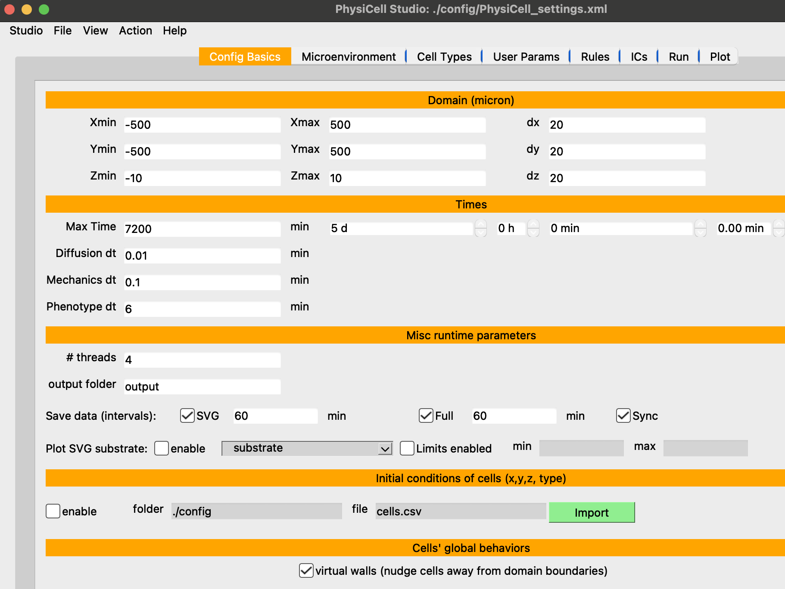

# studio_template

This repository contains a version of PhysiCell Studio with an appropriate 
executable model (`project`) for their computer (currently just Windows or Mac).
We assume you have a Python installation on your computer (you should).

Download the latest release of this repository and uncompress it which will create a `studio` directory.

From a command line terminal, run the following (only necessary if you are using your computer's default Python and not the Anaconda distribution):
```
cd studio
pip3 install -r requirements.txt
```

You should then be ready to run:
```
python bin/studio.py
```
to display the Studio GUI:



and run a simulation (`project` or `project.exe` executable in the Run tab).


