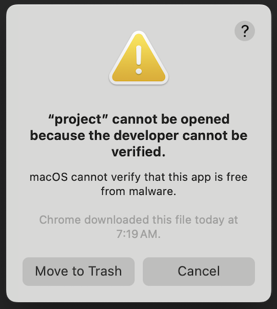

# studio_template

This repository contains a version of PhysiCell Studio with an appropriate 
executable model (`project`) for their computer (currently just Windows or Mac).
You need Python 3 installed on your computer (which will include the `pip3` command used below). Verify that you do and if not, install it:

## Step 1) Install Python (if you don't have it)

### On Windows:
Follow these steps or see the Anaconda option below.
```
* open a Command Line or Powershell terminal and type "python"
If it comes back with "Python 3.xx.xx" then you should be good.
You can type "quit()" at the Python prompt (">>>") to exit the interpreter.
```

Otherwise, if it says "command not found", then download and install Python 3.11 from the [Microsoft Store](https://apps.microsoft.com/search?query=python&hl=en-us&gl=US).

### On a Mac:
Follow these steps or see the Anaconda option (next).
```
* open a Terminal shell and type "python"
If it comes back with "Python 3.xx.xx" then you should be good.
You can type "quit()" at the Python prompt (">>>") to exit the interpreter.
```
Otherwise, if it says "command not found", then download and install the latest "macOS 64-bit universal2 installer" from [www.python.org/downloads/macos/](https://www.python.org/downloads/macos/).

### Platform independent: install the Anaconda Python
* https://www.anaconda.com/download (note there's a "Skip registration" option) - this option will figure out what operating system you are running and download the appropriate Python package. It will be somewhat large, but will contain most of the dependencies for the Studio.

---
## Step 2) Get the bundled Studio (this repo)

Download the latest release (.zip at https://github.com/rheiland/studio_template/releases) of this repository and uncompress it which will create a `studio` directory.

From a command line terminal, run the following:
```
cd studio_template-0.4   # or whatever the release suffix is
cd studio
pip3 install -r requirements.txt
```

You should then be ready to run:
```
python3 bin/studio.py
```
to display the Studio GUI:


and run a simulation (`project` or `project.exe` executable in the Run tab).


---
## MacOS security issue for the project executable

If you are on a Mac, you will most likely encounter a security issue when you try to run the `project` executable (either from the Studio's Run tab or just from the command line in the Terminal (with the command `./project`):



You need to `Cancel` to close that warning then open a Finder window. From the Terminal window, in the "studio" directory of this repo, just type `open .` ("open" command, followed by a space and a "period"):
```
~/studio_template-0.4/studio$ open .
```
This will open a Finder window containing the files in this directory. You want to "control-select" (hold down the "control" key and use your mouse or trackpad to select) the `project` file:


Then select the `Open` option. You will see another popup warning dialog about "macOS cannot verify...", but click its `Open` button. This will allow you to run the `project` file from then on. 


---
## Recovering the original template model

Making changes to the template model in the Studio will update the `config/PhysiCell_settings.xml` file. If you ever want to recover the original model, you can `File -> Load user project`, select the `user_projects` `studio_template`, and then `File -> Open` the `config/PhysiCell_settings.xml`.

---
## Installing and running from Windows Powershell

After downloading the latest release (.zip), follow the usual Windows steps to "extract" the files, or if you have the "unzip" command in Powershell, you could use it as shown here:
```
PS C:\Users\heiland> mv C:\Users\heiland\Downloads\studio_template-0.4.zip .
PS C:\Users\heiland> unzip .\studio_template-0.4.zip
PS C:\Users\heiland> cd .\studio_template-0.4\studio\
PS C:\Users\heiland\studio_template-0.4\studio> pip3 install -r .\requirements.txt
PS C:\Users\heiland\studio_template-0.4\studio> python3 .\bin\studio.py
```


---
Details of the Windows installation (for an earlier release):
```
Windows PowerShell
Copyright (C) Microsoft Corporation. All rights reserved.

Install the latest PowerShell for new features and improvements! https://aka.ms/PSWindows

PS C:\Users\heiland> mv C:\Users\heiland\Downloads\studio_template-0.1.zip .
PS C:\Users\heiland> unzip .\studio_template-0.1.zip
Archive:  .\studio_template-0.1.zip
486a9efc2ee61c3c6e8017e0d18050767b9a9c79
   creating: studio_template-0.1/
  inflating: studio_template-0.1/README.md
....

PS C:\Users\heiland> cd .\studio_template-0.1\
PS C:\Users\heiland\studio_template-0.1> cd .\studio\

PS C:\Users\heiland\studio_template-0.1\studio> pip3 install -r .\requirements.txt
Defaulting to user installation because normal site-packages is not writeable
Collecting PyQt5 (from -r .\requirements.txt (line 1))
...
Downloading simulariumio-1.11.0-py3-none-any.whl (7.1 MB)
   ━━━━━━━━━━━━━━━━━━━━━━━━━━━━━━━━━━━━━━━━ 7.1/7.1 MB 8.1 MB/s eta 0:00:00
Installing collected packages: scipy, requests, PyQt5, pandas, matplotlib, simulariumio, anndata
  WARNING: The scripts pylupdate5.exe, pyrcc5.exe and pyuic5.exe are installed in 'C:\Users\heiland\AppData\Local\Packages\PythonSoftwareFoundation.Python.3.12_qbz5n2kfra8p0\LocalCache\local-packages\Python312\Scripts' which is not on PATH.
  Consider adding this directory to PATH or, if you prefer to suppress this warning, use --no-warn-script-location.
ERROR: Could not install packages due to an OSError: [Errno 2] No such file or directory: 'C:\\Users\\heiland\\AppData\\Local\\Packages\\PythonSoftwareFoundation.Python.3.12_qbz5n2kfra8p0\\LocalCache\\local-packages\\Python312\\site-packages\\simulariumio\\tests\\data\\cytosim\\aster_pull3D_couples_actin_solid_3_frames\\aster_pull3D_couples_actin_solid_3_frames.json'
HINT: This error might have occurred since this system does not have Windows Long Path support enabled. You can find information on how to enable this at https://pip.pypa.io/warnings/enable-long-paths

PS C:\Users\heiland\studio_template-0.1\studio>
PS C:\Users\heiland\studio_template-0.1\studio> python3 .\bin\studio.py
...few secs delay before Studio displays
```
